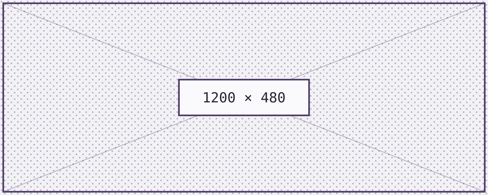
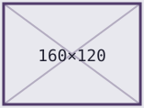
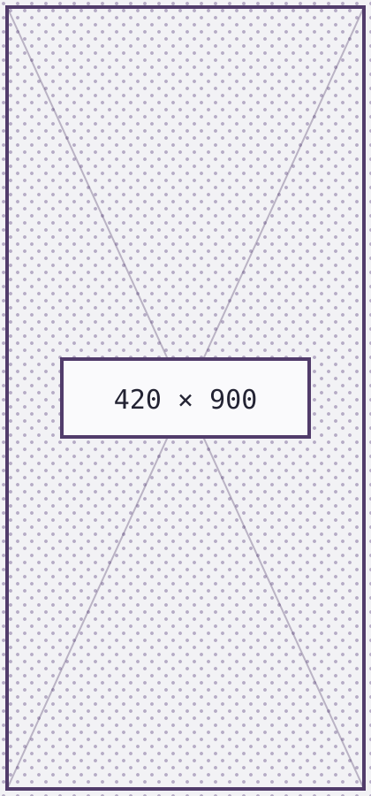

+++
title = 'Style Guide: Media and Callouts'
date = 2026-08-22
tags = ['style-guide', 'placeholder']
tldr = 'Placeholder post. Images, figures and the callout shortcode, including the sizes that overflow the measure.'
toc = true
+++

Placeholder content. This post is a leaf bundle, so its images sit next to
`index.md` and are referenced relatively -- which keeps them correct under a
sub-path `baseURL`, unlike a hand-written `/images/...` link.

## Images

A plain Markdown image, wider than the measure, so `img { max-width: 100% }`
has something to clamp:

A small image, well under the measure, which should keep its natural size and
its 2px border:

A tall image, where the `max-height` on `figure img` does *not* apply because
there is no figure around it:

An image wrapped in a link, which picks up both the image border and the link
styling:

## Figures

The `figure` shortcode renders the title as an `h4`, which the stylesheet
prefixes with an arrow:









## Callouts

One line:



Several lines, to check the padding on a block that wraps:



Two in a row, to check the gap between them:





A callout directly after a heading:

### Heading, then a callout



## Media inside other blocks

An image inside a list item:

- A list item with an image below it:

  

- A plain list item after it

An image inside a blockquote:

> 
>
> Quoted, with the image inside the quote's background.
